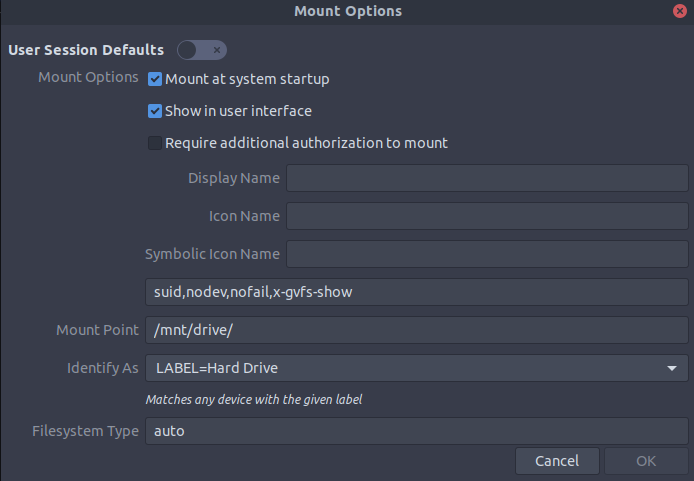

## What
How to mount the docker data directory to another drive

## Why

To save space, of course!

## How

1. Configure dockers daemon.json
    ```
    sudo gedit /etc/docker/daemon.json
    ```

1. Add the following line
    ```
    "data-root": "/PATH/TO/MOUNT/docker"
    ```

1. Make sure the drive is mounted with `suid` option, and not `nosuid`, otherwise
once in a blue moon `sudo` won't work on a docker build.
   
   
